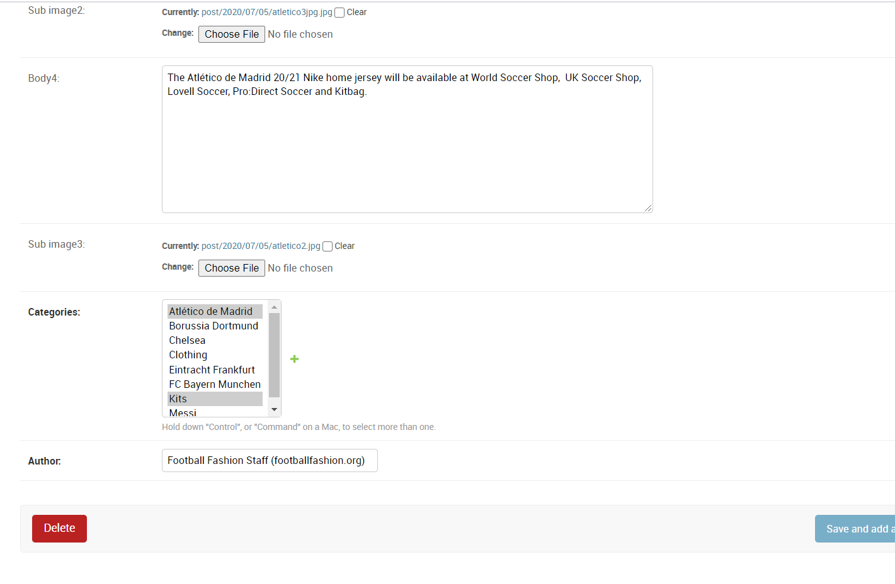

preview at:  http://football4fashion.herokuapp.com/
FootballFashion is a web blog which contains the following:

an index page to display the posts in the blog

a detail page to display the contents of a post

an archive page to sort posts based on the categories and and text search, 

a contact page to display contact info and a send custom message to the blogger

an about page to display info about the blog

Key features:

Admin mamagement: the blogger can visit the '/admin/' to add new post and category, edit 
posts and edit constant site parameters like site name, slogan, about info, blogger's 
contact email address.

samples of the admin funtionalities are 

Environmental variables used are:
DATABASE_URL,
EMAIL_HOST,
EMAIL_HOST_USER,
EMAIL_HOST_PASSWORD
